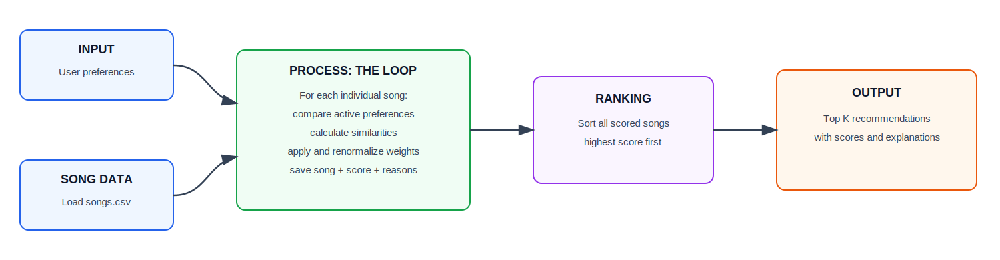

# 🎵 Music Recommender Simulation

## Project Summary

In this project you will build and explain a small music recommender system.

Your goal is to:

- Represent songs and a user "taste profile" as data
- Design a scoring rule that turns that data into recommendations
- Evaluate what your system gets right and wrong
- Reflect on how this mirrors real world AI recommenders

This version expands the starter catalog to 60 songs and uses an explainable content-based design to compare optional user preferences with song metadata. Five project-added attributes—release year, duration, instrumentalness, popularity, and liveness—add era, listening-context, vocal-content, discovery, and recording-environment signals while keeping every recommendation traceable to a weighted score breakdown.

---

## How The System Works

This simulator uses **content-based filtering**. It compares each song's descriptive features with one user's stated preferences, calculates a weighted score, sorts the songs from highest to lowest score, and returns the top results with an explanation.

The expanded recommendation design supports twelve preference-bearing features:

- `genre` and `mood`: 18% each
- `energy`: 11%
- `tempo_bpm`, `valence`, `danceability`, and `acousticness`: 7% each
- `instrumentalness`: 6%
- `liveness`, `release_year`, and `popularity`: 5% each
- `duration_seconds`: 4%

`preferred_genres` and `preferred_moods` are optional multi-select controls with an **Any** option. Exact category matches receive full credit, while a limited set of developer-defined related labels may receive partial credit. Numeric targets for the other ten features are optional advanced preferences. Unselected preferences are excluded, the remaining weights are renormalized, and at least one preference must be active. The proposed profile and formulas are documented in [Content-Based Recommender Dataset Analysis](content_based_recommender_dataset_analysis.md).

Recommendation explanations use progressive disclosure: they first describe the strongest matches in plain language, then identify which available features were **not considered** because the user did not select them. A technical score breakdown can be shown as optional detail. The displayed score is a deterministic compatibility score based only on active preferences; it is not a probability that the user will like the song.


### Feature origin

| Source | Features | How they are used |
|---|---|---|
| Starter project CSV | `id`, `title`, `artist`, `genre`, `mood`, `energy`, `tempo_bpm`, `valence`, `danceability`, `acousticness` | Identity, display, scoring, and analysis |
| Added during this project | `release_year`, `duration_seconds`, `instrumentalness`, `popularity`, `liveness` | Five additional scoring attributes for era, listening context, vocal content, discovery preference, and recording environment |

The five added columns and the 50 added songs contain synthetic values. Their structure is inspired by common music-catalog and audio-analysis metadata, but the values were not downloaded from or measured by Spotify, YouTube, or another streaming platform.

### Expected biases

This system may over-prioritize genre and mood because they receive 36% of the full score, causing it to miss strong songs that match the user's audio preferences but use different labels. Category counts also vary across the catalog. The limited related-category pairs are hand-written heuristics based on developer judgment; they are not relationships learned by AI or inferred from listening behavior. Musical relationships can vary by song, listener, culture, and listening context, so these rules may oversimplify compatibility.

For this simulator, the preferred baseline is exact genre and mood matching combined with numeric audio-feature similarity. This allows compatible songs to surface across category boundaries without requiring a subjective relationship rule. Related-category credit should remain optional, explicit, testable, and easy to disable. A production platform could instead learn relationships from sufficiently representative playlist, play, skip, like, and replay data.

### System flow

#### Quick data flow

[](diagrams/recommender_quick_data_flow.mmd)

#### Detailed scoring design

[](diagrams/recommender_system_flow.mmd)

---

## Getting Started

### Setup

1. Create a virtual environment (optional but recommended):

   ```bash
   python -m venv .venv
   source .venv/bin/activate      # Mac or Linux
   .venv\Scripts\activate         # Windows

2. Install dependencies

```bash
pip install -r requirements.txt
```

3. Run the app:

```bash
python -m src.main
```

### Running Tests

Run the starter tests with:

```bash
pytest
```

You can add more tests in `tests/test_recommender.py`.

---

## Sample Recommendation Output

This representative CLI sample was generated with Pop and Happy preferences plus `target_energy=0.8`. The current `python -m src.main` command runs the complete six-profile evaluation documented under [Experiments You Tried](#experiments-you-tried).

```text
Loaded songs: 60

========================================================================
TOP MUSIC RECOMMENDATIONS
========================================================================

1. Sunrise City - Neon Echo
   Genre: Pop | Mood: Happy
   Match score: 99.5 / 100

   Why we recommended it:
     ✓ Genre: Pop matches your Pop preference
     ✓ Mood: Happy matches your Happy preference
     ✓ Energy: Very close to your target
       You requested 0.80; this song is 0.82

   Based on: Genre, mood, and energy
   Not considered: Tempo, valence, danceability, acousticness,
     instrumentalness, liveness, release year, duration, and popularity

   How the score was calculated:

   Factor             Match    Importance    Score points
   ------------------------------------------------------
   Genre              100%         38.3%            38.3
   Mood               100%         38.3%            38.3
   Energy              98%         23.4%            22.9
   ------------------------------------------------------
   Final score                                       99.5 / 100
   ---------------------------------------------------------------------

2. Rooftop Lights - Indigo Parade
   Genre: Indie Pop | Mood: Happy
   Match score: 79.9 / 100

   Why we recommended it:
     ~ Genre: Indie Pop is related to your Pop preference
     ✓ Mood: Happy matches your Happy preference
     ✓ Energy: Very close to your target
       You requested 0.80; this song is 0.76

   Based on: Genre, mood, and energy
   Not considered: Tempo, valence, danceability, acousticness,
     instrumentalness, liveness, release year, duration, and popularity

   How the score was calculated:

   Factor             Match    Importance    Score points
   ------------------------------------------------------
   Genre               50%         38.3%            19.1
   Mood               100%         38.3%            38.3
   Energy              96%         23.4%            22.5
   ------------------------------------------------------
   Final score                                       79.9 / 100
   ---------------------------------------------------------------------

3. Starlight Signal - Nova Seven
   Genre: Pop | Mood: Celebratory
   Match score: 79.0 / 100

   Why we recommended it:
     ✓ Genre: Pop matches your Pop preference
     ~ Mood: Celebratory is related to your Happy preference
     ✓ Energy: Close to your target
       You requested 0.80; this song is 0.88

   Based on: Genre, mood, and energy
   Not considered: Tempo, valence, danceability, acousticness,
     instrumentalness, liveness, release year, duration, and popularity

   How the score was calculated:

   Factor             Match    Importance    Score points
   ------------------------------------------------------
   Genre              100%         38.3%            38.3
   Mood                50%         38.3%            19.1
   Energy              92%         23.4%            21.5
   ------------------------------------------------------
   Final score                                       79.0 / 100
   ---------------------------------------------------------------------

4. Sunlit Mosaic - Harmony Market
   Genre: Indie Pop | Mood: Happy
   Match score: 77.6 / 100

   Why we recommended it:
     ~ Genre: Indie Pop is related to your Pop preference
     ✓ Mood: Happy matches your Happy preference
     ✓ Energy: Close to your target
       You requested 0.80; this song is 0.66

   Based on: Genre, mood, and energy
   Not considered: Tempo, valence, danceability, acousticness,
     instrumentalness, liveness, release year, duration, and popularity

   How the score was calculated:

   Factor             Match    Importance    Score points
   ------------------------------------------------------
   Genre               50%         38.3%            19.1
   Mood               100%         38.3%            38.3
   Energy              86%         23.4%            20.1
   ------------------------------------------------------
   Final score                                       77.6 / 100
   ---------------------------------------------------------------------

5. Lagos Sunrise - Kora Avenue
   Genre: World | Mood: Happy
   Match score: 61.7 / 100

   Why we recommended it:
     ✗ Genre: World does not match your Pop preference
     ✓ Mood: Happy matches your Happy preference
     ✓ Energy: Very close to your target
       You requested 0.80; this song is 0.80

   Based on: Genre, mood, and energy
   Not considered: Tempo, valence, danceability, acousticness,
     instrumentalness, liveness, release year, duration, and popularity

   How the score was calculated:

   Factor             Match    Importance    Score points
   ------------------------------------------------------
   Genre                0%         38.3%             0.0
   Mood               100%         38.3%            38.3
   Energy             100%         23.4%            23.4
   ------------------------------------------------------
   Final score                                       61.7 / 100
   ---------------------------------------------------------------------
```

Only genre, mood, and energy affect this run. Tempo, valence, danceability, acousticness, instrumentalness, liveness, release year, duration, and popularity are not considered because the default profile does not select them; they receive neither credit nor a penalty.

---

## Experiments You Tried

The CLI was evaluated with three realistic profiles, two adversarial profiles, and one sparse edge case. Each block below is terminal output from `python -m src.main`

The adversarial profiles test conflicting preferences and an out-of-vocabulary mood. The symbols mean `✓` strong match, `~` partial match, and `✗` no match.
### High-Energy Pop

```text
########################################################################
PROFILE: High-Energy Pop
Preferences: {'preferred_genres': ['pop'], 'preferred_moods': ['happy'], 'target_energy': 0.9, 'target_valence': 0.85, 'target_danceability': 0.85}
########################################################################

========================================================================
TOP MUSIC RECOMMENDATIONS
========================================================================

1. Sunrise City - Neon Echo
   Genre: Pop | Mood: Happy
   Match score: 97.8 / 100

   Why we recommended it:
     ✓ Genre: Pop matches your Pop preference
     ✓ Mood: Happy matches your Happy preference
     ✓ Energy: Close to your target
       You requested 0.90; this song is 0.82
     ✓ Valence: Very close to your target
       You requested 0.85; this song is 0.84
     ✓ Danceability: Close to your target
       You requested 0.85; this song is 0.79

   Based on: Genre, mood, energy, valence, and danceability
   Not considered: Tempo, acousticness, instrumentalness, liveness,
     release year, duration, and popularity

   How the score was calculated:

   Factor             Match    Importance    Score points
   ------------------------------------------------------
   Genre              100%         29.5%            29.5
   Mood               100%         29.5%            29.5
   Energy              92%         18.0%            16.6
   Valence             99%         11.5%            11.4
   Danceability        94%         11.5%            10.8
   ------------------------------------------------------
   Final score                                       97.8 / 100
   ---------------------------------------------------------------------

2. Starlight Signal - Nova Seven
   Genre: Pop | Mood: Celebratory
   Match score: 82.8 / 100

   Why we recommended it:
     ✓ Genre: Pop matches your Pop preference
     ~ Mood: Celebratory is related to your Happy preference
     ✓ Energy: Very close to your target
       You requested 0.90; this song is 0.88
     ✓ Valence: Close to your target
       You requested 0.85; this song is 0.95
     ✓ Danceability: Close to your target
       You requested 0.85; this song is 0.93

   Based on: Genre, mood, energy, valence, and danceability
   Not considered: Tempo, acousticness, instrumentalness, liveness,
     release year, duration, and popularity

   How the score was calculated:

   Factor             Match    Importance    Score points
   ------------------------------------------------------
   Genre              100%         29.5%            29.5
   Mood                50%         29.5%            14.8
   Energy              98%         18.0%            17.7
   Valence             90%         11.5%            10.3
   Danceability        92%         11.5%            10.6
   ------------------------------------------------------
   Final score                                       82.8 / 100
   ---------------------------------------------------------------------

3. Rooftop Lights - Indigo Parade
   Genre: Indie Pop | Mood: Happy
   Match score: 81.9 / 100

   Why we recommended it:
     ~ Genre: Indie Pop is related to your Pop preference
     ✓ Mood: Happy matches your Happy preference
     ✓ Energy: Close to your target
       You requested 0.90; this song is 0.76
     ✓ Valence: Very close to your target
       You requested 0.85; this song is 0.81
     ✓ Danceability: Very close to your target
       You requested 0.85; this song is 0.82

   Based on: Genre, mood, energy, valence, and danceability
   Not considered: Tempo, acousticness, instrumentalness, liveness,
     release year, duration, and popularity

   How the score was calculated:

   Factor             Match    Importance    Score points
   ------------------------------------------------------
   Genre               50%         29.5%            14.8
   Mood               100%         29.5%            29.5
   Energy              86%         18.0%            15.5
   Valence             96%         11.5%            11.0
   Danceability        97%         11.5%            11.1
   ------------------------------------------------------
   Final score                                       81.9 / 100
   ---------------------------------------------------------------------

4. Sunlit Mosaic - Harmony Market
   Genre: Indie Pop | Mood: Happy
   Match score: 79.8 / 100

   Why we recommended it:
     ~ Genre: Indie Pop is related to your Pop preference
     ✓ Mood: Happy matches your Happy preference
     ~ Energy: Somewhat close to your target
       You requested 0.90; this song is 0.66
     ✓ Valence: Very close to your target
       You requested 0.85; this song is 0.88
     ✓ Danceability: Close to your target
       You requested 0.85; this song is 0.78

   Based on: Genre, mood, energy, valence, and danceability
   Not considered: Tempo, acousticness, instrumentalness, liveness,
     release year, duration, and popularity

   How the score was calculated:

   Factor             Match    Importance    Score points
   ------------------------------------------------------
   Genre               50%         29.5%            14.8
   Mood               100%         29.5%            29.5
   Energy              76%         18.0%            13.7
   Valence             97%         11.5%            11.1
   Danceability        93%         11.5%            10.7
   ------------------------------------------------------
   Final score                                       79.8 / 100
   ---------------------------------------------------------------------

5. Gym Hero - Max Pulse
   Genre: Pop | Mood: Intense
   Match score: 68.7 / 100

   Why we recommended it:
     ✓ Genre: Pop matches your Pop preference
     ✗ Mood: Intense does not match your Happy preference
     ✓ Energy: Very close to your target
       You requested 0.90; this song is 0.93
     ✓ Valence: Close to your target
       You requested 0.85; this song is 0.77
     ✓ Danceability: Very close to your target
       You requested 0.85; this song is 0.88

   Based on: Genre, mood, energy, valence, and danceability
   Not considered: Tempo, acousticness, instrumentalness, liveness,
     release year, duration, and popularity

   How the score was calculated:

   Factor             Match    Importance    Score points
   ------------------------------------------------------
   Genre              100%         29.5%            29.5
   Mood                 0%         29.5%             0.0
   Energy              97%         18.0%            17.5
   Valence             92%         11.5%            10.6
   Danceability        97%         11.5%            11.1
   ------------------------------------------------------
   Final score                                       68.7 / 100
   ---------------------------------------------------------------------
```

**Observation:** The strongest result matches both selected categories and closely matches all three numeric targets. Lower-ranked songs expose category trade-offs clearly.

### Chill Lofi

```text
########################################################################
PROFILE: Chill Lofi
Preferences: {'preferred_genres': ['lofi'], 'preferred_moods': ['chill'], 'target_energy': 0.2, 'target_acousticness': 0.7, 'target_instrumentalness': 0.85}
########################################################################

========================================================================
TOP MUSIC RECOMMENDATIONS
========================================================================

1. Midnight Coding - LoRoom
   Genre: Lofi | Mood: Chill
   Match score: 95.6 / 100

   Why we recommended it:
     ✓ Genre: Lofi matches your Lofi preference
     ✓ Mood: Chill matches your Chill preference
     ~ Energy: Somewhat close to your target
       You requested 0.20; this song is 0.42
     ✓ Acousticness: Very close to your target
       You requested 0.70; this song is 0.71
     ✓ Instrumentalness: Very close to your target
       You requested 0.85; this song is 0.82

   Based on: Genre, mood, energy, acousticness, and instrumentalness
   Not considered: Tempo, valence, danceability, liveness, release year,
     duration, and popularity

   How the score was calculated:

   Factor             Match    Importance    Score points
   ------------------------------------------------------
   Genre              100%         30.0%            30.0
   Mood               100%         30.0%            30.0
   Energy              78%         18.3%            14.3
   Acousticness        99%         11.7%            11.6
   Instrumentalness    97%         10.0%             9.7
   ------------------------------------------------------
   Final score                                       95.6 / 100
   ---------------------------------------------------------------------

2. Library Rain - Paper Lanterns
   Genre: Lofi | Mood: Chill
   Match score: 94.8 / 100

   Why we recommended it:
     ✓ Genre: Lofi matches your Lofi preference
     ✓ Mood: Chill matches your Chill preference
     ✓ Energy: Close to your target
       You requested 0.20; this song is 0.35
     ✓ Acousticness: Close to your target
       You requested 0.70; this song is 0.86
     ✓ Instrumentalness: Close to your target
       You requested 0.85; this song is 0.91

   Based on: Genre, mood, energy, acousticness, and instrumentalness
   Not considered: Tempo, valence, danceability, liveness, release year,
     duration, and popularity

   How the score was calculated:

   Factor             Match    Importance    Score points
   ------------------------------------------------------
   Genre              100%         30.0%            30.0
   Mood               100%         30.0%            30.0
   Energy              85%         18.3%            15.6
   Acousticness        84%         11.7%             9.8
   Instrumentalness    94%         10.0%             9.4
   ------------------------------------------------------
   Final score                                       94.8 / 100
   ---------------------------------------------------------------------

3. Stillwater Breath - Inner Current
   Genre: Ambient | Mood: Chill
   Match score: 80.3 / 100

   Why we recommended it:
     ~ Genre: Ambient is related to your Lofi preference
     ✓ Mood: Chill matches your Chill preference
     ✓ Energy: Very close to your target
       You requested 0.20; this song is 0.19
     ~ Acousticness: Somewhat close to your target
       You requested 0.70; this song is 0.97
     ✓ Instrumentalness: Close to your target
       You requested 0.85; this song is 0.99

   Based on: Genre, mood, energy, acousticness, and instrumentalness
   Not considered: Tempo, valence, danceability, liveness, release year,
     duration, and popularity

   How the score was calculated:

   Factor             Match    Importance    Score points
   ------------------------------------------------------
   Genre               50%         30.0%            15.0
   Mood               100%         30.0%            30.0
   Energy              99%         18.3%            18.2
   Acousticness        73%         11.7%             8.5
   Instrumentalness    86%         10.0%             8.6
   ------------------------------------------------------
   Final score                                       80.3 / 100
   ---------------------------------------------------------------------

4. Focus Flow - LoRoom
   Genre: Lofi | Mood: Focused
   Match score: 80.1 / 100

   Why we recommended it:
     ✓ Genre: Lofi matches your Lofi preference
     ~ Mood: Focused is related to your Chill preference
     ✓ Energy: Close to your target
       You requested 0.20; this song is 0.40
     ✓ Acousticness: Close to your target
       You requested 0.70; this song is 0.78
     ✓ Instrumentalness: Very close to your target
       You requested 0.85; this song is 0.88

   Based on: Genre, mood, energy, acousticness, and instrumentalness
   Not considered: Tempo, valence, danceability, liveness, release year,
     duration, and popularity

   How the score was calculated:

   Factor             Match    Importance    Score points
   ------------------------------------------------------
   Genre              100%         30.0%            30.0
   Mood                50%         30.0%            15.0
   Energy              80%         18.3%            14.7
   Acousticness        92%         11.7%            10.7
   Instrumentalness    97%         10.0%             9.7
   ------------------------------------------------------
   Final score                                       80.1 / 100
   ---------------------------------------------------------------------

5. Spacewalk Thoughts - Orbit Bloom
   Genre: Ambient | Mood: Chill
   Match score: 79.9 / 100

   Why we recommended it:
     ~ Genre: Ambient is related to your Lofi preference
     ✓ Mood: Chill matches your Chill preference
     ✓ Energy: Close to your target
       You requested 0.20; this song is 0.28
     ~ Acousticness: Somewhat close to your target
       You requested 0.70; this song is 0.92
     ✓ Instrumentalness: Close to your target
       You requested 0.85; this song is 0.96

   Based on: Genre, mood, energy, acousticness, and instrumentalness
   Not considered: Tempo, valence, danceability, liveness, release year,
     duration, and popularity

   How the score was calculated:

   Factor             Match    Importance    Score points
   ------------------------------------------------------
   Genre               50%         30.0%            15.0
   Mood               100%         30.0%            30.0
   Energy              92%         18.3%            16.9
   Acousticness        78%         11.7%             9.1
   Instrumentalness    89%         10.0%             8.9
   ------------------------------------------------------
   Final score                                       79.9 / 100
   ---------------------------------------------------------------------
```

**Observation:** The top two songs exactly match Lofi and Chill. Related Ambient and Focused songs demonstrate how partial category similarity broadens the results.

### Deep Intense Rock

```text
########################################################################
PROFILE: Deep Intense Rock
Preferences: {'preferred_genres': ['rock'], 'preferred_moods': ['intense'], 'target_energy': 0.9, 'target_valence': 0.25, 'target_tempo_bpm': 150}
########################################################################

========================================================================
TOP MUSIC RECOMMENDATIONS
========================================================================

1. Concrete Weather - North Static
   Genre: Rock | Mood: Intense
   Match score: 98.8 / 100

   Why we recommended it:
     ✓ Genre: Rock matches your Rock preference
     ✓ Mood: Intense matches your Intense preference
     ✓ Energy: Very close to your target
       You requested 0.90; this song is 0.90
     ✓ Tempo: Very close to your target
       You requested 150 BPM; this song is 148 BPM
     ✓ Valence: Close to your target
       You requested 0.25; this song is 0.34

   Based on: Genre, mood, energy, tempo, and valence
   Not considered: Danceability, acousticness, instrumentalness,
     liveness, release year, duration, and popularity

   How the score was calculated:

   Factor             Match    Importance    Score points
   ------------------------------------------------------
   Genre              100%         29.5%            29.5
   Mood               100%         29.5%            29.5
   Energy             100%         18.0%            18.0
   Tempo               99%         11.5%            11.3
   Valence             91%         11.5%            10.4
   ------------------------------------------------------
   Final score                                       98.8 / 100
   ---------------------------------------------------------------------

2. Storm Runner - Voltline
   Genre: Rock | Mood: Intense
   Match score: 97.0 / 100

   Why we recommended it:
     ✓ Genre: Rock matches your Rock preference
     ✓ Mood: Intense matches your Intense preference
     ✓ Energy: Very close to your target
       You requested 0.90; this song is 0.91
     ✓ Tempo: Very close to your target
       You requested 150 BPM; this song is 152 BPM
     ~ Valence: Somewhat close to your target
       You requested 0.25; this song is 0.48

   Based on: Genre, mood, energy, tempo, and valence
   Not considered: Danceability, acousticness, instrumentalness,
     liveness, release year, duration, and popularity

   How the score was calculated:

   Factor             Match    Importance    Score points
   ------------------------------------------------------
   Genre              100%         29.5%            29.5
   Mood               100%         29.5%            29.5
   Energy              99%         18.0%            17.9
   Tempo               99%         11.5%            11.3
   Valence             77%         11.5%             8.8
   ------------------------------------------------------
   Final score                                       97.0 / 100
   ---------------------------------------------------------------------

3. Iron Horizon - Crimson Anvil
   Genre: Rock | Mood: Intense
   Match score: 96.8 / 100

   Why we recommended it:
     ✓ Genre: Rock matches your Rock preference
     ✓ Mood: Intense matches your Intense preference
     ✓ Energy: Close to your target
       You requested 0.90; this song is 0.97
     ✓ Tempo: Close to your target
       You requested 150 BPM; this song is 168 BPM
     ✓ Valence: Very close to your target
       You requested 0.25; this song is 0.29

   Based on: Genre, mood, energy, tempo, and valence
   Not considered: Danceability, acousticness, instrumentalness,
     liveness, release year, duration, and popularity

   How the score was calculated:

   Factor             Match    Importance    Score points
   ------------------------------------------------------
   Genre              100%         29.5%            29.5
   Mood               100%         29.5%            29.5
   Energy              93%         18.0%            16.8
   Tempo               87%         11.5%            10.0
   Valence             96%         11.5%            11.0
   ------------------------------------------------------
   Final score                                       96.8 / 100
   ---------------------------------------------------------------------

4. Steel and Dust - Red Mesa Outlaws
   Genre: Rock | Mood: Intense
   Match score: 94.2 / 100

   Why we recommended it:
     ✓ Genre: Rock matches your Rock preference
     ✓ Mood: Intense matches your Intense preference
     ✓ Energy: Very close to your target
       You requested 0.90; this song is 0.86
     ✓ Tempo: Close to your target
       You requested 150 BPM; this song is 136 BPM
     ~ Valence: Somewhat close to your target
       You requested 0.25; this song is 0.59

   Based on: Genre, mood, energy, tempo, and valence
   Not considered: Danceability, acousticness, instrumentalness,
     liveness, release year, duration, and popularity

   How the score was calculated:

   Factor             Match    Importance    Score points
   ------------------------------------------------------
   Genre              100%         29.5%            29.5
   Mood               100%         29.5%            29.5
   Energy              96%         18.0%            17.3
   Tempo               90%         11.5%            10.3
   Valence             66%         11.5%             7.6
   ------------------------------------------------------
   Final score                                       94.2 / 100
   ---------------------------------------------------------------------

5. Basement Anthem - Static Youth
   Genre: Rock | Mood: Intense
   Match score: 93.4 / 100

   Why we recommended it:
     ✓ Genre: Rock matches your Rock preference
     ✓ Mood: Intense matches your Intense preference
     ✓ Energy: Very close to your target
       You requested 0.90; this song is 0.94
     ✓ Tempo: Close to your target
       You requested 150 BPM; this song is 176 BPM
     ~ Valence: Somewhat close to your target
       You requested 0.25; this song is 0.58

   Based on: Genre, mood, energy, tempo, and valence
   Not considered: Danceability, acousticness, instrumentalness,
     liveness, release year, duration, and popularity

   How the score was calculated:

   Factor             Match    Importance    Score points
   ------------------------------------------------------
   Genre              100%         29.5%            29.5
   Mood               100%         29.5%            29.5
   Energy              96%         18.0%            17.3
   Tempo               82%         11.5%             9.4
   Valence             67%         11.5%             7.7
   ------------------------------------------------------
   Final score                                       93.4 / 100
   ---------------------------------------------------------------------
```

**Observation:** All five results exactly match Rock and Intense, while energy, tempo, and valence determine their final order.

### Adversarial: Sad but Euphoric

```text
########################################################################
PROFILE: Adversarial: Sad but Euphoric
Preferences: {'preferred_moods': ['sad'], 'target_energy': 0.95, 'target_valence': 0.95}
########################################################################

========================================================================
TOP MUSIC RECOMMENDATIONS
========================================================================

1. Neon Festival - Prism Circuit
   Genre: Electronic | Mood: Celebratory
   Match score: 48.5 / 100

   Why we recommended it:
     ✗ Mood: Celebratory does not match your Sad preference
     ✓ Energy: Very close to your target
       You requested 0.95; this song is 0.96
     ✓ Valence: Close to your target
       You requested 0.95; this song is 0.89

   Based on: Mood, energy, and valence
   Not considered: Genre, tempo, danceability, acousticness,
     instrumentalness, liveness, release year, duration, and popularity

   How the score was calculated:

   Factor             Match    Importance    Score points
   ------------------------------------------------------
   Mood                 0%         50.0%             0.0
   Energy              99%         30.6%            30.3
   Valence             94%         19.4%            18.3
   ------------------------------------------------------
   Final score                                       48.5 / 100
   ---------------------------------------------------------------------

2. Carnival Sky - Bahia Motion
   Genre: Latin | Mood: Celebratory
   Match score: 48.3 / 100

   Why we recommended it:
     ✗ Mood: Celebratory does not match your Sad preference
     ✓ Energy: Very close to your target
       You requested 0.95; this song is 0.90
     ✓ Valence: Very close to your target
       You requested 0.95; this song is 0.96

   Based on: Mood, energy, and valence
   Not considered: Genre, tempo, danceability, acousticness,
     instrumentalness, liveness, release year, duration, and popularity

   How the score was calculated:

   Factor             Match    Importance    Score points
   ------------------------------------------------------
   Mood                 0%         50.0%             0.0
   Energy              95%         30.6%            29.0
   Valence             99%         19.4%            19.3
   ------------------------------------------------------
   Final score                                       48.3 / 100
   ---------------------------------------------------------------------

3. Starlight Signal - Nova Seven
   Genre: Pop | Mood: Celebratory
   Match score: 47.9 / 100

   Why we recommended it:
     ✗ Mood: Celebratory does not match your Sad preference
     ✓ Energy: Close to your target
       You requested 0.95; this song is 0.88
     ✓ Valence: Very close to your target
       You requested 0.95; this song is 0.95

   Based on: Mood, energy, and valence
   Not considered: Genre, tempo, danceability, acousticness,
     instrumentalness, liveness, release year, duration, and popularity

   How the score was calculated:

   Factor             Match    Importance    Score points
   ------------------------------------------------------
   Mood                 0%         50.0%             0.0
   Energy              93%         30.6%            28.4
   Valence            100%         19.4%            19.4
   ------------------------------------------------------
   Final score                                       47.9 / 100
   ---------------------------------------------------------------------

4. Midnight Salsa - Orquesta Brisa
   Genre: Latin | Mood: Romantic
   Match score: 47.2 / 100

   Why we recommended it:
     ✗ Mood: Romantic does not match your Sad preference
     ✓ Energy: Close to your target
       You requested 0.95; this song is 0.87
     ✓ Valence: Very close to your target
       You requested 0.95; this song is 0.93

   Based on: Mood, energy, and valence
   Not considered: Genre, tempo, danceability, acousticness,
     instrumentalness, liveness, release year, duration, and popularity

   How the score was calculated:

   Factor             Match    Importance    Score points
   ------------------------------------------------------
   Mood                 0%         50.0%             0.0
   Energy              92%         30.6%            28.1
   Valence             98%         19.4%            19.1
   ------------------------------------------------------
   Final score                                       47.2 / 100
   ---------------------------------------------------------------------

5. Mirrorball Avenue - Velvet Comet
   Genre: Electronic | Mood: Celebratory
   Match score: 46.8 / 100

   Why we recommended it:
     ✗ Mood: Celebratory does not match your Sad preference
     ✓ Energy: Close to your target
       You requested 0.95; this song is 0.85
     ✓ Valence: Very close to your target
       You requested 0.95; this song is 0.94

   Based on: Mood, energy, and valence
   Not considered: Genre, tempo, danceability, acousticness,
     instrumentalness, liveness, release year, duration, and popularity

   How the score was calculated:

   Factor             Match    Importance    Score points
   ------------------------------------------------------
   Mood                 0%         50.0%             0.0
   Energy              90%         30.6%            27.5
   Valence             99%         19.4%            19.3
   ------------------------------------------------------
   Final score                                       46.8 / 100
   ---------------------------------------------------------------------
```

**Observation:** `sad` is outside the dataset's mood vocabulary, so every song receives zero mood credit. High-energy, high-valence songs still rise to the top, revealing the need for input validation or an unknown-category warning.

### Adversarial: Moody but Euphoric

```text
########################################################################
PROFILE: Adversarial: Moody but Euphoric
Preferences: {'preferred_moods': ['moody'], 'target_energy': 0.95, 'target_valence': 0.95}
########################################################################

========================================================================
TOP MUSIC RECOMMENDATIONS
========================================================================

1. Machine Pulse - Grid Operator
   Genre: Electronic | Mood: Moody
   Match score: 86.4 / 100

   Why we recommended it:
     ✓ Mood: Moody matches your Moody preference
     ✓ Energy: Close to your target
       You requested 0.95; this song is 0.88
     ~ Valence: Far from your target
       You requested 0.95; this song is 0.36

   Based on: Mood, energy, and valence
   Not considered: Genre, tempo, danceability, acousticness,
     instrumentalness, liveness, release year, duration, and popularity

   How the score was calculated:

   Factor             Match    Importance    Score points
   ------------------------------------------------------
   Mood               100%         50.0%            50.0
   Energy              93%         30.6%            28.4
   Valence             41%         19.4%             8.0
   ------------------------------------------------------
   Final score                                       86.4 / 100
   ---------------------------------------------------------------------

2. The Last Crown - Teatro Celeste
   Genre: Classical | Mood: Moody
   Match score: 86.3 / 100

   Why we recommended it:
     ✓ Mood: Moody matches your Moody preference
     ✓ Energy: Close to your target
       You requested 0.95; this song is 0.82
     ~ Valence: Far from your target
       You requested 0.95; this song is 0.45

   Based on: Mood, energy, and valence
   Not considered: Genre, tempo, danceability, acousticness,
     instrumentalness, liveness, release year, duration, and popularity

   How the score was calculated:

   Factor             Match    Importance    Score points
   ------------------------------------------------------
   Mood               100%         50.0%            50.0
   Energy              87%         30.6%            26.6
   Valence             50%         19.4%             9.7
   ------------------------------------------------------
   Final score                                       86.3 / 100
   ---------------------------------------------------------------------

3. Night Drive Loop - Neon Echo
   Genre: Synthwave | Mood: Moody
   Match score: 84.9 / 100

   Why we recommended it:
     ✓ Mood: Moody matches your Moody preference
     ✓ Energy: Close to your target
       You requested 0.95; this song is 0.75
     ~ Valence: Far from your target
       You requested 0.95; this song is 0.49

   Based on: Mood, energy, and valence
   Not considered: Genre, tempo, danceability, acousticness,
     instrumentalness, liveness, release year, duration, and popularity

   How the score was calculated:

   Factor             Match    Importance    Score points
   ------------------------------------------------------
   Mood               100%         50.0%            50.0
   Energy              80%         30.6%            24.4
   Valence             54%         19.4%            10.5
   ------------------------------------------------------
   Final score                                       84.9 / 100
   ---------------------------------------------------------------------

4. Analog Memories - Cassette Hearts
   Genre: Rock | Mood: Moody
   Match score: 81.9 / 100

   Why we recommended it:
     ✓ Mood: Moody matches your Moody preference
     ~ Energy: Somewhat close to your target
       You requested 0.95; this song is 0.69
     ~ Valence: Far from your target
       You requested 0.95; this song is 0.43

   Based on: Mood, energy, and valence
   Not considered: Genre, tempo, danceability, acousticness,
     instrumentalness, liveness, release year, duration, and popularity

   How the score was calculated:

   Factor             Match    Importance    Score points
   ------------------------------------------------------
   Mood               100%         50.0%            50.0
   Energy              74%         30.6%            22.6
   Valence             48%         19.4%             9.3
   ------------------------------------------------------
   Final score                                       81.9 / 100
   ---------------------------------------------------------------------

5. Desert Caravan - Nomad Mosaic
   Genre: World | Mood: Moody
   Match score: 80.1 / 100

   Why we recommended it:
     ✓ Mood: Moody matches your Moody preference
     ~ Energy: Somewhat close to your target
       You requested 0.95; this song is 0.58
     ~ Valence: Far from your target
       You requested 0.95; this song is 0.51

   Based on: Mood, energy, and valence
   Not considered: Genre, tempo, danceability, acousticness,
     instrumentalness, liveness, release year, duration, and popularity

   How the score was calculated:

   Factor             Match    Importance    Score points
   ------------------------------------------------------
   Mood               100%         50.0%            50.0
   Energy              63%         30.6%            19.2
   Valence             56%         19.4%            10.9
   ------------------------------------------------------
   Final score                                       80.1 / 100
   ---------------------------------------------------------------------
```

**Observation:** The exact Moody match contributes half of the active score and outweighs poor valence compatibility. This demonstrates how conflicting preferences interact with normalized weights.

### Edge Case: Popularity Only

```text
########################################################################
PROFILE: Edge Case: Popularity Only
Preferences: {'target_popularity': 100}
########################################################################

========================================================================
TOP MUSIC RECOMMENDATIONS
========================================================================

1. Starlight Signal - Nova Seven
   Genre: Pop | Mood: Celebratory
   Match score: 90.0 / 100

   Why we recommended it:
     ✓ Popularity: Close to your target
       You requested 100/100; this song is 90/100

   Based on: Popularity
   Not considered: Genre, mood, energy, tempo, valence, danceability,
     acousticness, instrumentalness, liveness, release year, and
     duration

   How the score was calculated:

   Factor             Match    Importance    Score points
   ------------------------------------------------------
   Popularity          90%        100.0%            90.0
   ------------------------------------------------------
   Final score                                       90.0 / 100
   ---------------------------------------------------------------------

2. Gym Hero - Max Pulse
   Genre: Pop | Mood: Intense
   Match score: 88.0 / 100

   Why we recommended it:
     ✓ Popularity: Close to your target
       You requested 100/100; this song is 88/100

   Based on: Popularity
   Not considered: Genre, mood, energy, tempo, valence, danceability,
     acousticness, instrumentalness, liveness, release year, and
     duration

   How the score was calculated:

   Factor             Match    Importance    Score points
   ------------------------------------------------------
   Popularity          88%        100.0%            88.0
   ------------------------------------------------------
   Final score                                       88.0 / 100
   ---------------------------------------------------------------------

3. Neon Festival - Prism Circuit
   Genre: Electronic | Mood: Celebratory
   Match score: 86.0 / 100

   Why we recommended it:
     ✓ Popularity: Close to your target
       You requested 100/100; this song is 86/100

   Based on: Popularity
   Not considered: Genre, mood, energy, tempo, valence, danceability,
     acousticness, instrumentalness, liveness, release year, and
     duration

   How the score was calculated:

   Factor             Match    Importance    Score points
   ------------------------------------------------------
   Popularity          86%        100.0%            86.0
   ------------------------------------------------------
   Final score                                       86.0 / 100
   ---------------------------------------------------------------------

4. Victory Lap - Southside Crown
   Genre: Hip Hop | Mood: Confident
   Match score: 85.0 / 100

   Why we recommended it:
     ✓ Popularity: Close to your target
       You requested 100/100; this song is 85/100

   Based on: Popularity
   Not considered: Genre, mood, energy, tempo, valence, danceability,
     acousticness, instrumentalness, liveness, release year, and
     duration

   How the score was calculated:

   Factor             Match    Importance    Score points
   ------------------------------------------------------
   Popularity          85%        100.0%            85.0
   ------------------------------------------------------
   Final score                                       85.0 / 100
   ---------------------------------------------------------------------

5. Rooftop Lights - Indigo Parade
   Genre: Indie Pop | Mood: Happy
   Match score: 84.0 / 100

   Why we recommended it:
     ✓ Popularity: Close to your target
       You requested 100/100; this song is 84/100

   Based on: Popularity
   Not considered: Genre, mood, energy, tempo, valence, danceability,
     acousticness, instrumentalness, liveness, release year, and
     duration

   How the score was calculated:

   Factor             Match    Importance    Score points
   ------------------------------------------------------
   Popularity          84%        100.0%            84.0
   ------------------------------------------------------
   Final score                                       84.0 / 100
   ---------------------------------------------------------------------
```

**Observation:** With only popularity active, the recommender becomes a popularity ranking rather than a musically personalized recommendation.

---

## Limitations and Risks

- The catalog contains only 60 songs, and most added metadata values are synthetic rather than platform measurements.
- The system has no behavioral feedback such as plays, skips, likes, replays, or playlist co-occurrence, so it cannot learn preferences automatically.
- Related genre and mood pairs reflect developer's assumptions and may not represent every listener or cultural context.
- The model does not analyze lyrics, language, artist similarity, recency trends, or changes in a listener's taste over time.
- A small or uneven catalog limits recommendation diversity and may provide more choices for some categories than others.
- Unsupported category values are not rejected. In the experiment, `sad` matched no catalog mood, yet the system still returned celebratory songs based on energy and valence.
- Sparse or conflicting profiles can produce deceptively high compatibility scores. For example, removing mood nearly doubled the Sad/Euphoric score, while a popularity-only profile became a non-personalized popularity ranking.

The sensitivity tests exposed two concrete weaknesses: the system needs validation for unsupported labels, and it needs a warning or minimum-input policy for sparse and conflicting profiles. These limitations are partially mitigated through visible score explanations, optional preferences, active-weight renormalization, category-level evaluation, and the ability to disable related-category rules. See the [Scoring Sensitivity Experiment](scoring_sensitivity_experiment.md) for the tested logic changes, ranking comparisons, and math verification. Additional design detail appears in the [Content-Based Recommender Dataset Analysis](content_based_recommender_dataset_analysis.md) and `model_card.md`.

---

## Reflection

Read and complete `model_card.md`:

[**Model Card**](model_card.md)

Write 1 to 2 paragraphs here about what you learned:

- about how recommenders turn data into predictions
- about where bias or unfairness could show up in systems like this


